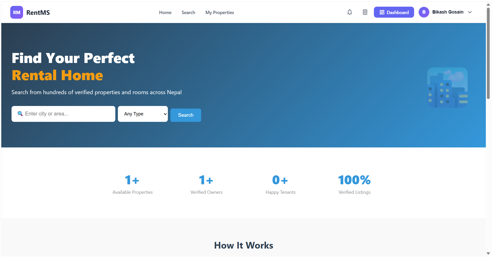
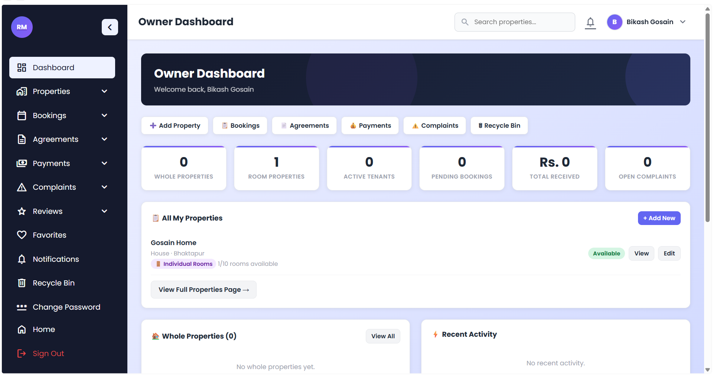
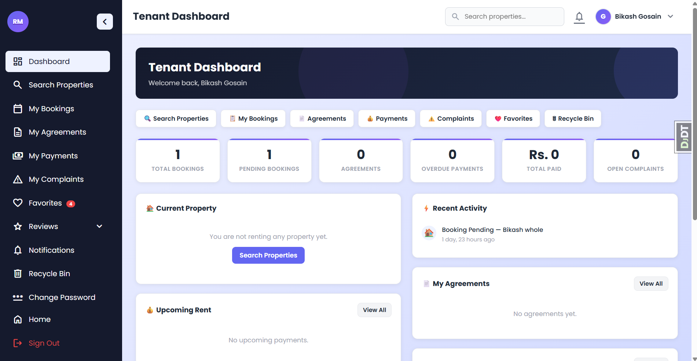

# 🏠 RentMS — Rent Management System

<div align="center">

[](https://www.bikashgosain.com.np/)
[](https://python.org)
[](https://djangoproject.com)
[](https://render.com)
[](https://github.com/BikashGosain/Rent_Management_System/actions)

**A full-featured property rental management platform built with Django.**  
Manage properties, bookings, agreements, payments, complaints and more — all in one place.

[🌐 Live Demo](https://www.bikashgosain.com.np/) · [🐛 Report Bug](https://github.com/BikashGosain/Rent_Management_System/issues) · [✨ Request Feature](https://github.com/BikashGosain/Rent_Management_System/issues)

</div>

---

## 📸 Screenshots

| Home Page | Owner Dashboard | Tenant Dashboard |
|-----------|-----------------|------------------|
|  |  |  |

---

## ✨ Features

### 👤 Authentication
- ✅ Register with email + OTP verification (email & SMS)
- ✅ Login with username/password
- ✅ Google OAuth (Sign in with Google)
- ✅ Forgot password via OTP reset
- ✅ Account inactive until OTP verified
- ✅ Show/hide password toggle
- ✅ Role-based access (Owner / Tenant / Admin)

### 🏠 Properties
- ✅ Add, edit, delete properties
- ✅ Whole property and individual room types
- ✅ Property search with filters (city, rent type, price range)
- ✅ Property detail with photo gallery
- ✅ Availability status management

### 📋 Bookings
- ✅ Tenant can book whole properties or individual rooms
- ✅ Owner can accept or reject bookings
- ✅ Booking status tracking (pending / accepted / rejected / cancelled)
- ✅ Soft delete with recycle bin

### 📄 Agreements
- ✅ Fixed term, month-to-month, and short-term rental agreements
- ✅ Digital signing by both owner and tenant
- ✅ Agreement extension requests (tenant/owner can request)
- ✅ Notice to vacate system with countdown
- ✅ Early termination and mutual termination requests
- ✅ Auto-mark property as available when agreement ends

### 💰 Payments
- ✅ Monthly rent payment tracking
- ✅ Payment status (pending / paid / overdue / cancelled)
- ✅ Owner and tenant payment views
- ✅ Soft delete with recycle bin

### ⚠️ Complaints
- ✅ Tenant can submit complaints to owner
- ✅ Owner can raise tenant issues
- ✅ Priority levels (low / medium / high / urgent)
- ✅ Status tracking (open / in progress / resolved / closed)

### 🔔 Notifications
- ✅ Real-time notification system
- ✅ Unread notification count in navbar
- ✅ Mark all as read
- ✅ Dashboard notifications page

### ❤️ Bookmarks / Favorites
- ✅ Tenants can bookmark properties and rooms
- ✅ Favorites list with comparison
- ✅ Saved properties on tenant dashboard

### 🗑 Recycle Bin
- ✅ Soft delete across all models
- ✅ Restore deleted items
- ✅ Permanent delete option
- ✅ Role-based recycle bin (each user sees their own deleted items)

### 👨‍💼 Admin
- ✅ Custom admin dashboard with system overview
- ✅ User management
- ✅ Django admin panel
- ✅ Auto superuser creation on deploy

---

## 🛠 Tech Stack

| Layer | Technology |
|-------|-----------|
| **Backend** | Django 6.0, Python 3.12 |
| **Database** | PostgreSQL (production), SQLite (development) |
| **Authentication** | Django Auth, Social Auth (Google OAuth2) |
| **OTP** | Email (SMTP) + SMS (Twilio) |
| **Frontend** | HTML5, CSS3, Vanilla JS |
| **File Storage** | Cloudinary / Local |
| **Deployment** | Render |
| **CI/CD** | GitHub Actions |
| **DNS** | Cloudflare |

---

## 📁 Project Structure

```
Rent_Management_System/
├── apps/
│   ├── accounts/          # Auth, OTP, Google OAuth, Profile
│   ├── agreements/        # Rental agreements, extensions, notices
│   ├── bookings/          # Property bookings
│   ├── bookmarks/         # Favorites / saved properties
│   ├── complaints/        # Complaints system
│   ├── core/              # Home, recycle bin, soft delete
│   ├── dashboard/         # Owner, tenant, admin dashboards
│   ├── notifications/     # Notification system
│   ├── payments/          # Payment tracking
│   ├── properties/        # Property management
│   ├── reviews/           # Reviews system
│   └── search/            # Property search
├── config/
│   ├── settings/
│   │   ├── base.py        # Shared settings
│   │   ├── development.py # Local dev settings
│   │   └── production.py  # Production settings
│   ├── urls.py
│   └── wsgi.py
├── static/
│   ├── css/               # Stylesheets
│   └── js/                # JavaScript
├── templates/
│   ├── base.html          # Public navbar layout
│   ├── dashboard_base.html# Dashboard sidebar layout
│   ├── accounts/          # Auth templates
│   ├── errors/            # 404, 500 error pages
│   └── ...
├── requirements/
│   ├── base.txt
│   ├── development.txt
│   └── production.txt
├── .github/
│   └── workflows/
│       ├── ci.yml         # Test on every push
│       └── deploy.yml     # Deploy to Render on main
└── manage.py
```

---

## 🚀 Getting Started

### Prerequisites
- Python 3.12+
- pip
- Git

### 1. Clone the repository
```bash
git clone https://github.com/BikashGosain/Rent_Management_System.git
cd Rent_Management_System
```

### 2. Create virtual environment
```bash
# Windows
python -m venv venv
venv\Scripts\activate

# Mac/Linux
python -m venv venv
source venv/bin/activate
```

### 3. Install dependencies
```bash
pip install -r requirements/development.txt
```

### 4. Create `.env` file
```bash
# Copy the example env file
cp .env.example .env
```

Fill in your `.env`:
```dotenv
SECRET_KEY=your-secret-key-here
DEBUG=True
DJANGO_SETTINGS_MODULE=config.settings.development

# Google OAuth
GOOGLE_CLIENT_ID=your-google-client-id
GOOGLE_SECRET=your-google-secret

# Email (Gmail SMTP)
EMAIL_HOST_USER=your-email@gmail.com
EMAIL_HOST_PASSWORD=your-app-password

# Twilio SMS
TWILIO_ACCOUNT_SID=your-twilio-sid
TWILIO_AUTH_TOKEN=your-twilio-token
TWILIO_PHONE_NUMBER=+1234567890

# Superuser (for create_superuser_default command)
SUPERUSER_USERNAME=admin
SUPERUSER_EMAIL=admin@example.com
SUPERUSER_PASSWORD=YourStrongPassword123!
```

### 5. Run migrations
```bash
python manage.py migrate
```

### 6. Create superuser
```bash
python manage.py create_superuser_default
```

### 7. Run the development server
```bash
python manage.py runserver
```

Visit: `http://127.0.0.1:8000`

---

## 🔑 User Roles

| Role | Access |
|------|--------|
| **Owner** | Add properties, manage bookings, create agreements, track payments, raise complaints |
| **Tenant** | Search properties, book, sign agreements, pay rent, submit complaints, save favorites |
| **Admin** | Full system access, user management, Django admin panel |

---

## 🌐 Google OAuth Setup

1. Go to [Google Cloud Console](https://console.cloud.google.com)
2. Create a new project
3. Enable **Google+ API** and **Google OAuth2 API**
4. Create OAuth 2.0 credentials
5. Add authorized redirect URIs:
   ```
   http://127.0.0.1:8000/auth/complete/google-oauth2/
   https://yourdomain.com/auth/complete/google-oauth2/
   ```
6. Copy Client ID and Secret to your `.env`

---

## 📦 Deployment (Render)

### Build Command
```bash
pip install -r requirements/production.txt && python manage.py collectstatic --noinput && python manage.py migrate && python manage.py create_superuser_default
```

### Start Command
```bash
gunicorn config.wsgi:application
```

### Environment Variables (set in Render Dashboard)
```
SECRET_KEY
DEBUG=False
DJANGO_SETTINGS_MODULE=config.settings.production
DATABASE_URL
GOOGLE_CLIENT_ID
GOOGLE_SECRET
EMAIL_HOST_USER
EMAIL_HOST_PASSWORD
TWILIO_ACCOUNT_SID
TWILIO_AUTH_TOKEN
TWILIO_PHONE_NUMBER
SUPERUSER_USERNAME
SUPERUSER_EMAIL
SUPERUSER_PASSWORD
```

---

## 🧪 Running Tests

```bash
python manage.py test tests --settings=config.settings.development -v 2
```

Or with CI:
```bash
# Tests run automatically on every push via GitHub Actions
# See .github/workflows/ci.yml
```

---

## 🔄 CI/CD Pipeline

```
Push to any branch
      ↓
GitHub Actions (ci.yml)
  → Install dependencies
  → Run migrations
  → Check for missing migrations
  → Django system checks
  → Run tests
      ↓
Push to main branch
      ↓
GitHub Actions (deploy.yml)
  → Trigger Render deploy
      ↓
Render
  → Install dependencies
  → Collect static files
  → Run migrations
  → Create superuser (if not exists)
  → Start Gunicorn
```

---

## 📋 Environment Variables Reference

| Variable | Required | Description |
|----------|----------|-------------|
| `SECRET_KEY` | ✅ | Django secret key |
| `DEBUG` | ✅ | True for dev, False for prod |
| `DATABASE_URL` | Production | PostgreSQL connection URL |
| `GOOGLE_CLIENT_ID` | Optional | Google OAuth client ID |
| `GOOGLE_SECRET` | Optional | Google OAuth secret |
| `EMAIL_HOST_USER` | Optional | Gmail address for sending OTP |
| `EMAIL_HOST_PASSWORD` | Optional | Gmail app password |
| `TWILIO_ACCOUNT_SID` | Optional | Twilio account SID for SMS |
| `TWILIO_AUTH_TOKEN` | Optional | Twilio auth token |
| `TWILIO_PHONE_NUMBER` | Optional | Twilio phone number |
| `SUPERUSER_USERNAME` | Optional | Default admin username |
| `SUPERUSER_EMAIL` | Optional | Default admin email |
| `SUPERUSER_PASSWORD` | Optional | Default admin password |

---

## 🤝 Contributing

1. Fork the repository
2. Create your feature branch: `git checkout -b feature/AmazingFeature`
3. Commit your changes: `git commit -m 'Add AmazingFeature'`
4. Push to the branch: `git push origin feature/AmazingFeature`
5. Open a Pull Request

---

## 📄 License

This project is licensed under the MIT License — see the [LICENSE](LICENSE) file for details.

---

## 👨‍💻 Author

**Bikash Gosain**

[](https://github.com/BikashGosain)
[](https://www.bikashgosain.com.np/)

---

<div align="center">
  <strong>🌐 Live at <a href="https://www.bikashgosain.com.np/">www.bikashgosain.com.np</a></strong>
  <br><br>
  Made with ❤️ using Django
</div>
